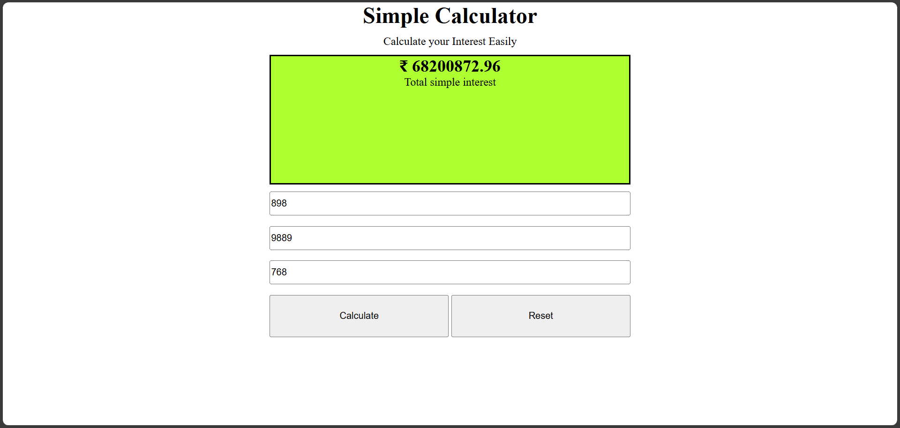

# 🧮 Simple Calculator

A clean and responsive **web-based calculator** built using **HTML**, **CSS**, and **JavaScript**. This project is designed to perform basic arithmetic operations with a modern UI.

---

## 📸 Interface Preview

---

## ✨ Features

- ➕ Addition  
- ➖ Subtraction  
- ✖️ Multiplication  
- ➗ Division  
- 🧼 Clear (AC)
- ✅ Real-time input and result display
- 🎨 Modern and responsive interface

---

## 🛠️ Built With

- 
- 
- 

---

